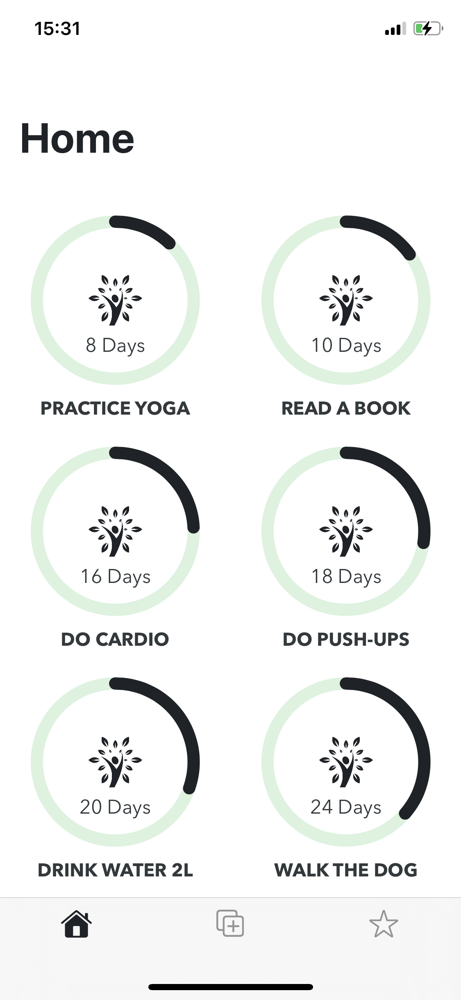
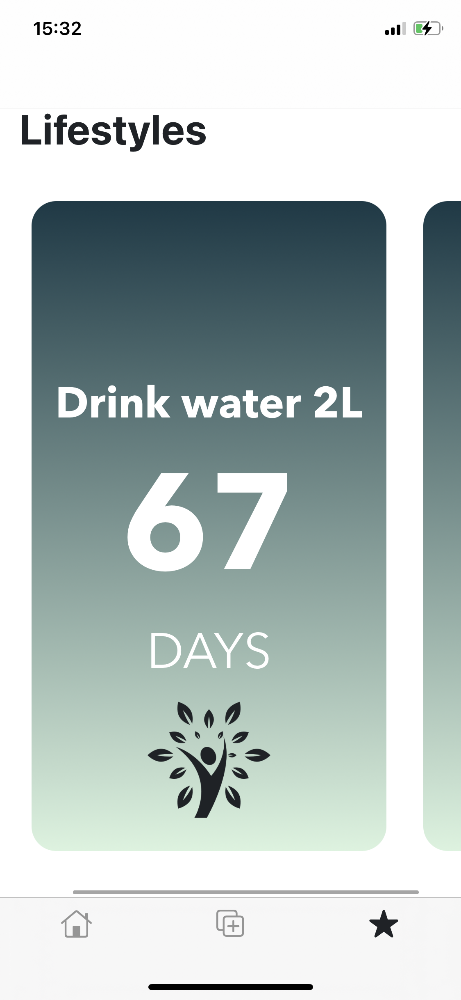
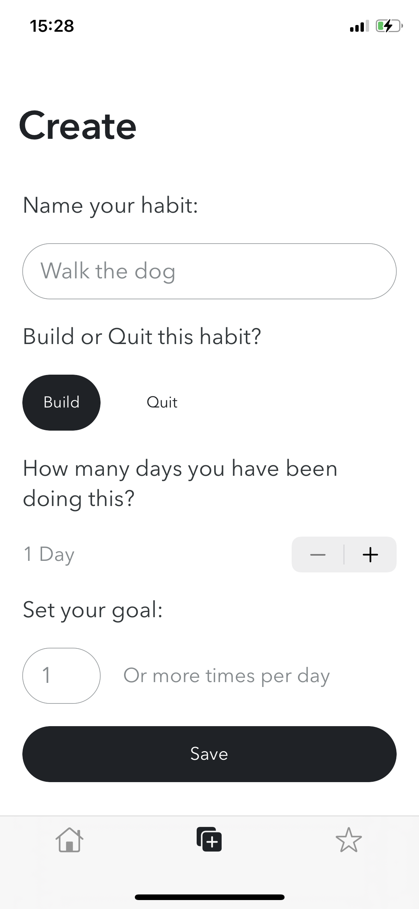

# Make-Life-Styles

Make Lifestyles is an iOS app which helps the users to track their daily habits and life styles. The purpose of this app is to motivate the users to gain useful habits and life styles into their lives. This app is free and open-source. So contributions are really welcome.
This app is available for iphones right now. Hopefully this app will be available for android phones soon.

## Screenshots

[](Screenshots/3.PNG)
[](Screenshots/5.PNG)
[](Screenshots/6.PNG)

## Getting Started

This app is totally developed without any third-party libraries. So it will be easier to get started.

### Installing

Clone the project

```
git clone https://github.com/Hansaanuradha93/Make-Life-Styles.git
```

Go to the directory

```
cd Make-Life-Styles
```

Open the project on Xcode and Run it on iphone simulator or a real device

## Authors

- **Hansa Wickramanayake** - [Click here](https://github.com/Hansaanuradha93)
